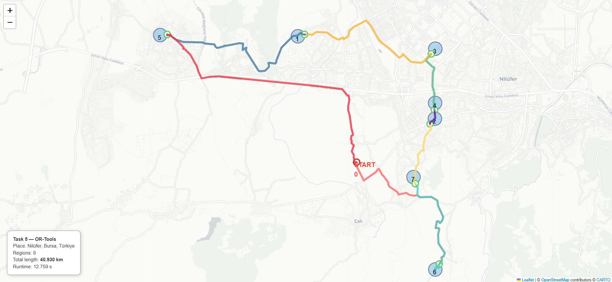
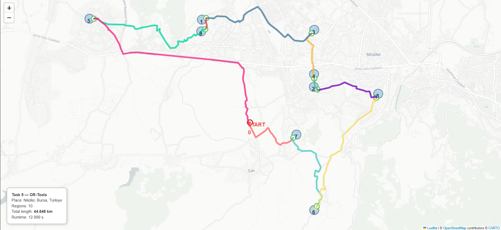
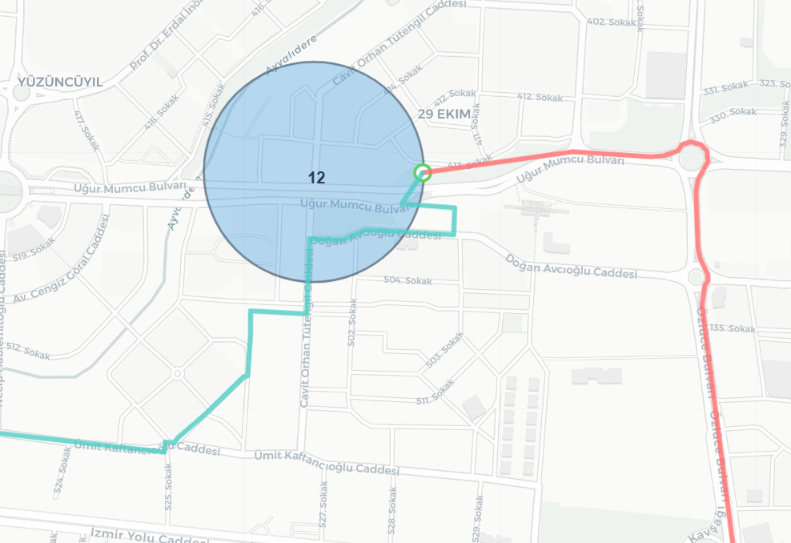

# Assignment 5: Traveling Salesman Problem with Neighborhoods (TSPN)

> Solving TSP with circular regions on real road networks using exact boundary intersection detection

---

## Overview

This assignment solves the **Traveling Salesman Problem with Neighborhoods (TSPN)** on real-world road networks. Unlike classical TSP where exact node visits are required, TSPN allows visiting any point within circular regions around target locations. The implementation uses OpenStreetMap data to compute realistic routes that follow actual roads.

### Key Features

- **Real road networks** - OpenStreetMap integration via OSMnx for authentic routing
- **Exact boundary detection** - Binary search with geodesic interpolation for precise circle intersection
- **Three-algorithm comparison** - Nearest Neighbor vs OR-Tools vs Genetic Algorithm
- **Interactive visualization** - Folium maps with detailed route geometry
- **Region-based routing** - Circular neighborhoods with configurable radius
- **Distance accuracy** - Road network distances (not euclidean "as-the-crow-flies")
- **Entry point tracking** - Exact GPS coordinates where routes cross circle boundaries

---

## Algorithm Details

### 1. Nearest Neighbor (NN)
**Greedy heuristic approach:**
1. Start at region 0 center
2. Build distance matrix between region centers using road network
3. Repeatedly visit nearest unvisited region
4. Compute actual tour with exact entry points

**Time Complexity:** O(n²) for distance matrix + O(n²) for tour construction  
**Advantages:** Very fast execution, simple implementation  
**Limitations:** No optimality guarantee, can produce suboptimal tours

### 2. OR-Tools Solver
**Advanced constraint programming approach:**
- Uses Google's RoutingModel with Guided Local Search
- Distance matrix computed on region centers
- 12-second time limit per instance
- Sophisticated branch-and-bound with heuristics

**Configuration:**
```python
params.first_solution_strategy = PATH_CHEAPEST_ARC
params.local_search_metaheuristic = GUIDED_LOCAL_SEARCH
params.time_limit.FromSeconds(12)
```

**Time Complexity:** Exponential worst-case with time limit  
**Advantages:** High-quality solutions for region ordering  
**Time Limit:** 12 seconds (configurable)

### 3. Genetic Algorithm (GA)
**Evolutionary computation approach:**
- Population-based search with tournament selection
- Order Crossover (OX) for tour recombination
- Swap mutation for local exploration
- Elitism to preserve best solutions

**Default Parameters:**
- Population Size: 120
- Generations: 300
- Crossover Rate: 0.8
- Mutation Rate: 0.25
- Tournament Size: 5
- Elitism Count: 2

**Time Complexity:** O(G × P × n²) where G=generations, P=population size

---

## TSPN-Specific Components

### Circle Intersection Detection

**Problem:** Find exact point where route crosses circular region boundary

**Solution:** Binary search with geodesic interpolation

```python
def line_circle_intersection(p1_lat, p1_lon, p2_lat, p2_lon, 
                             center_lat, center_lon, radius_m):
    # Binary search with 1-meter tolerance
    # Uses WGS84 ellipsoid for geodesic calculations
    # Max 50 iterations for convergence
```

**Algorithm:**
1. Detect crossing: previous node outside, current node inside
2. Binary search between the two nodes
3. Calculate geodesic midpoint
4. Check distance to circle center
5. Adjust search range until within 1-meter tolerance

**Accuracy:** ±1 meter on circle boundary

### Distance Calculation

**Critical difference from Assignment 4:**
- Assignment 4: Direct euclidean distances
- Assignment 5: Road network distances with exact entry points

**Leg distance calculation:**
```
distance = entry_point₁ → nearest_node → [road_path] → entry_node → entry_point₂
```

**Components:**
1. Geodesic distance from entry point to nearest road node
2. Path weight along road network (NetworkX)
3. Geodesic distance from path end to next entry point

### Route Geometry Extraction

**Problem:** Visualize paths that follow actual roads, not straight lines

**Solution:** Extract LineString geometry from OSMnx edges

```python
def extract_route_geometry(G, path_nodes):
    # For each edge in path:
    #   - Get edge geometry (LineString with GPS coordinates)
    #   - Extract all intermediate points
    #   - Build complete route coordinate list
```

**Result:** Smooth curves following real road geometry

---

## Usage

### Basic Execution
```bash
python task5.py --regions 10 --radius-m 250 --seed 42
```

### Parameters
| Parameter | Type | Default | Description |
|-----------|------|---------|-------------|
| `--place` | str | "Nilüfer, Bursa, Türkiye" | Location for road network |
| `--regions` | int | 10 | Number of circular regions |
| `--radius-m` | float | 250.0 | Radius of each circle (meters) |
| `--seed` | int | 42 | Random seed for reproducibility |
| `--start` | int | 0 | Starting region ID |
| `--graph-cache` | str | results/nilufer_drive.graphml | Cache file for road network |
| `--or-time-limit` | int | 12 | OR-Tools time limit (seconds) |
| `--ga-pop` | int | 120 | GA population size |
| `--ga-gen` | int | 300 | GA number of generations |
| `--outdir` | str | results | Output directory |

### Examples
```bash
# Default experiment (10 regions, 250m radius)
python task5.py --regions 10 --radius-m 250 --seed 42

# Small regions, more coverage
python task5.py --regions 15 --radius-m 150 --seed 77

# Large-scale experiment
python task5.py --regions 22 --radius-m 200 --seed 6016 --ga-gen 150

# Barcelona example (downloads new graph first time)
python task5.py --place "Eixample, Barcelona, Spain" --regions 12 --radius-m 300 --seed 42 --ga-gen 200 --outdir "real_map" --graph-cache "real_map/barcelona_eixample_drive.graphml"

# Custom output directory
python task5.py --outdir my_results --seed 100
```

---

## Output Files

### 1. Data Files (per solver)
- **paths_nearest.json** - Nearest Neighbor results
- **paths_or-tools.json** - OR-Tools results
- **paths_genetic.json** - Genetic Algorithm results

**Contents:**
```json
{
  "solver": "Nearest Neighbor",
  "place": "Nilüfer, Bursa, Türkiye",
  "regions": [...],
  "order": [0, 3, 1, 2, ...],
  "entry_points": [[40.1234, 28.5678], ...],
  "total_length_m": 36953.45,
  "runtime_s": 0.849,
  "leg_paths_nodes": [[node1, node2, ...], ...]
}
```

### 2. Interactive Maps
- **task5_nearest.html** - NN tour visualization
- **task5_or-tools.html** - OR-Tools tour visualization
- **task5_genetic.html** - GA tour visualization

**Map Features:**
- Filled circular regions with transparency
- Numbered region centers
- Exact entry points marked with green circles
- Route paths following actual roads with distinct colors
- Hover tooltips with distance information
- Summary box with tour statistics

### 3. Summary Table
- **summary.csv** - Comparative results

| solver | total_length_km | runtime_s | order | html_map |
|--------|----------------|-----------|-------|----------|
| Nearest Neighbor | 40.016 | 0.849 | [0,3,1,...] | results/task5_nearest.html |
| OR-Tools | 36.953 | 12.811 | [0,2,5,...] | results/task5_or-tools.html |
| Genetic Algorithm | 38.069 | 1.391 | [0,4,2,...] | results/task5_genetic.html |

### 4. Cached Graph
- **nilufer_drive.graphml** - OpenStreetMap road network (reused across runs)

---

## Visualization Examples

### Interactive Map Features

**Region Visualization:**
- Circular regions with light blue fill (opacity 0.35)
- Dark gray borders for clear boundaries
- Region 0 marked as "START" in red
- Other regions numbered in navy blue

**Entry Points:**
- Green circles at exact boundary intersection
- Red circle for starting point
- Tooltips showing:
  - Region ID
  - Distance to center
  - Distance to boundary (should be ~0-2m)
  - Circle radius

**Route Visualization:**
- Each leg in different color (25-color palette)
- Routes follow actual road curves
- Line weight: 5px for visibility
- Opacity: 0.8 for overlapping routes
- Tooltips showing leg information

### Example Output

#### 1. Small Scale (8 regions, 250m radius)


#### 2. Medium Scale (10 regions, 200m radius)


#### 3. Large Scale (22 regions, 200m radius)


#### 4. Entry Point Detail



---

## Example Results

### Sample Console Output
```
Task 5: TSP with Neighborhoods
Place: Nilüfer, Bursa, Türkiye
Regions: 10, Radius: 250.0m

Loading cached graph...
Generating regions...
Building distance matrix...

Running solvers...
  Running Nearest Neighbor...
    ✓ Length: 40.016 km, Time: 0.849s
  Running OR-Tools...
    ✓ Length: 36.953 km, Time: 12.811s
  Running Genetic Algorithm...
    ✓ Length: 38.069 km, Time: 1.391s

======================================================================
SUMMARY
======================================================================
           solver  total_length_km  runtime_s
 Nearest Neighbor        40.016197   0.848965
         OR-Tools        36.953124  12.810723
Genetic Algorithm        38.068571   1.391033

Outputs saved to: D:\...\Assignment-5\results
======================================================================
```

### Key Findings
- **Solution Quality:** OR-Tools (36.95 km) > GA (38.07 km) > NN (40.02 km)
- **Runtime:** NN (0.85s) < GA (1.39s) << OR-Tools (12.81s)
- **Quality Gap:** GA within 3% of OR-Tools, NN within 8%
- **Entry Point Accuracy:** All points within 0-2 meters of circle boundaries
- **Route Following:** 100% road-network paths, no straight-line shortcuts

---

## Technical Implementation

### 1. Graph Construction
```python
# Download from OpenStreetMap (first time only)
G = ox.graph_from_place(place, network_type="drive", simplify=True)

# Add edge lengths if missing
G = ox.add_edge_lengths(G)
```

### 2. Region Generation
```python
# Sample random nodes inside place boundary
candidates = [node for node in G.nodes if inside_boundary(node)]
sampled_nodes = random.sample(candidates, n_regions)

# Create circular regions
regions = [RegionCircle(id, lat, lon, radius_m) for ...]
```

### 3. Distance Matrix
```python
# Find nearest graph node to each region center
center_nodes = [ox.distance.nearest_nodes(G, lon, lat) for region in regions]

# Compute shortest path distances on road network
D[i][j] = nx.shortest_path_length(G, center_nodes[i], center_nodes[j], weight="length")
```

### 4. TSP Solving
```python
# Get region visiting order (all three solvers)
order = solver.solve(D, start=0)  # Returns: [0, 3, 1, 2, 5, ...]
```

### 5. Tour Computation with Entry Points
```python
for each leg in tour:
    # Find nearest node to current entry point
    start_node = ox.distance.nearest_nodes(G, entry_point[1], entry_point[0])
    
    # Compute path to next region center
    path = nx.shortest_path(G, start_node, next_center, weight="length")
    
    # Find exact boundary intersection
    entry_node, next_entry_point = find_boundary_intersection(G, path, next_region)
    
    # Calculate distance: entry_point → node → [path] → node → entry_point
    leg_distance = geodesic(entry_point, start_node) + 
                   path_weight(path) + 
                   geodesic(entry_node, next_entry_point)
```

### 6. Visualization
```python
# Create Folium map
map = folium.Map(location=[center_lat, center_lon], zoom_start=12)

# Draw regions with fill
folium.Circle(location=[lat, lon], radius=radius_m, 
              fill=True, fill_color="#3498db", fill_opacity=0.35)

# Draw exact entry points
folium.CircleMarker(location=entry_point, radius=8, color="#60CE60")

# Draw route with geometry
route_coords = [entry_point] + extract_route_geometry(G, path) + [next_entry_point]
folium.PolyLine(route_coords, color=colors[i], weight=5)
```

---

## Dependencies

```txt
networkx>=3.0
folium>=0.14.0
osmnx>=1.6.0
numpy>=1.24.0
pandas>=2.0.0
ortools>=9.6
pyproj>=3.4.0
```

### Installation
```bash
pip install -r requirements.txt
```

---


## Computational Notes

### Graph Download Time
- **First run:** 1-2 minutes (downloads from OpenStreetMap)
- **Subsequent runs:** <1 second (uses cached .graphml file)


### Runtime Breakdown
```
Graph loading:       0.5s  (cached) or 60s (first time)
Region generation:   0.1s
Distance matrix:     5-10s (depends on n_regions)
NN solver:          0.5-1s
OR-Tools solver:    12s (time limit)
GA solver:          1-2s (300 generations)
Visualization:      0.5s per map
```

---

## Troubleshooting

### "NetworkXNoPath" Exception
**Cause:** Disconnected graph regions  
**Solution:** Already handled by `safe_shortest_path()` wrapper

### "No nodes found inside boundary"
**Cause:** Location name not recognized or too small  
**Solution:** Use more specific place names or larger areas

### Graph download fails
**Cause:** Network issues or invalid location  
**Solution:** Check internet connection, verify place name with `ox.geocode()`

### Memory error on large graphs
**Cause:** Too many regions or large road network  
**Solution:** Reduce `--regions` or use smaller geographic area

---


## License

Educational project for AI in Computer Games course.


[](https://classroom.github.com/a/1I0u3uYp)
